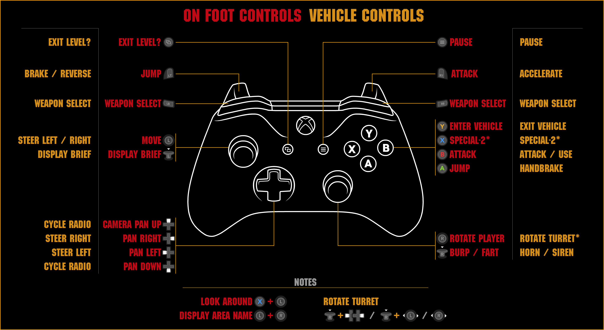

# gta2-twin-stick-mod
Grand Theft Auto 2 twin stick mod related repo.

Installation:
- Download `MISI.asi` and `twin_stick.lua`.
- Move `MISI.asi` into root game folder, next to GTA2.exe _(MISI optionally can be moved to scripts folder)_
- Place `twin_stick.lua` into scripts folder (create one if missing). Should look like: `..\GTA2\scripts\twin_stick.lua`.

Original  authors:
- [MISI mod](https://gtamp.com/forum/viewtopic.php?t=1136) : Logofero 
- [MISI fork and original TwinStick release](https://gtamp.com/forum/viewtopic.php?t=1150) : Dege, robotanarchy, Sektor 

